---
## Front matter
title: "Лабораторная работа №2"
subtitle: "Система контроля версий Git"
author: "Калашникова Дарья Викторовна"

## Generic otions
lang: ru-RU
toc-title: "Содержание"

## Bibliography
bibliography: bib/cite.bib
csl: pandoc/csl/gost-r-7-0-5-2008-numeric.csl

## Pdf output format
toc: true # Table of contents
toc-depth: 2
lof: true # List of figures
lot: true # List of tables
fontsize: 12pt
linestretch: 1.5
papersize: a4
documentclass: scrreprt
## I18n polyglossia
polyglossia-lang:
  name: russian
  options:
	- spelling=modern
	- babelshorthands=true
polyglossia-otherlangs:
  name: english
## I18n babel
babel-lang: russian
babel-otherlangs: english
## Fonts
mainfont: IBM Plex Serif
romanfont: IBM Plex Serif
sansfont: IBM Plex Sans
monofont: IBM Plex Mono
mathfont: STIX Two Math
mainfontoptions: Ligatures=Common,Ligatures=TeX,Scale=0.94
romanfontoptions: Ligatures=Common,Ligatures=TeX,Scale=0.94
sansfontoptions: Ligatures=Common,Ligatures=TeX,Scale=MatchLowercase,Scale=0.94
monofontoptions: Scale=MatchLowercase,Scale=0.94,FakeStretch=0.9
mathfontoptions:
## Biblatex
biblatex: true
biblio-style: "gost-numeric"
biblatexoptions:
  - parentracker=true
  - backend=biber
  - hyperref=auto
  - language=auto
  - autolang=other*
  - citestyle=gost-numeric
## Pandoc-crossref LaTeX customization
figureTitle: "Рис."
tableTitle: "Таблица"
listingTitle: "Листинг"
lofTitle: "Список иллюстраций"
lotTitle: "Список таблиц"
lolTitle: "Листинги"
## Misc options
indent: true
header-includes:
  - \usepackage{indentfirst}
  - \usepackage{float} # keep figures where there are in the text
  - \floatplacement{figure}{H} # keep figures where there are in the text
---

# Цель работы

Целью работы является изучить идеологию и применение средств контроля версий. Приобрести практические навыки по работе с системой git.

# Выполнение лабораторной работы

Перед началом работы с git его необходимо предварительно настроить. Для этого введем в терминал следующие команды: (рис. [-@fig:001]).

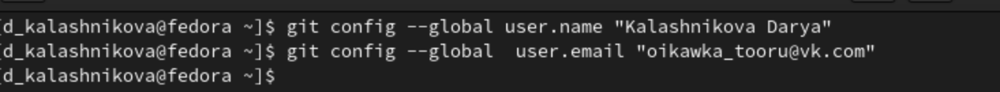{#fig:001 width=70%}

Введя их, мы задали имя и электронный адрес почты пользователя. Теперь введем следующую команду: (рис. [-@fig:002]).

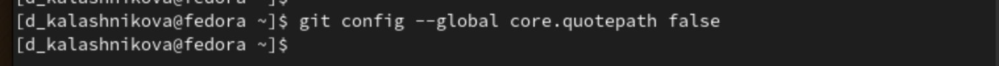{#fig:002 width=70%}

Благодаря ней, мы настроили вывод сообщений git в кодировке utf8. Теперь мы должны задать имя для (рис. [-@fig:003]). начальной ветки. Мы назовем ее master:

{#fig:003 width=70%}

Теперь введем следующую команду: (рис. [-@fig:004]).

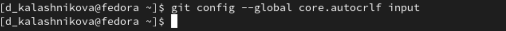{#fig:004 width=70%}

Таким образом мы указываем git автоматически конвертировать CRLF окончания строк в LF во время commit'а. Теперь выполним вот эту команду (рис. 5). Она будет отвечать за то, чтобы печатать предупреждение в случае, если преобразования из CRLF будут необратимыми. (рис. [-@fig:005]).

{#fig:005 width=70%}

Для того, чтобы сервер мог идентифицировать пользователя, необходимо сгенерировать несколько ssh ключей. Начнем с генерации открытого ключа. Для этого мы введем следующую команду, указав имя, фамилию пользователя и его адрес электронной почты в качестве аргумента: (рис. [-@fig:006]).

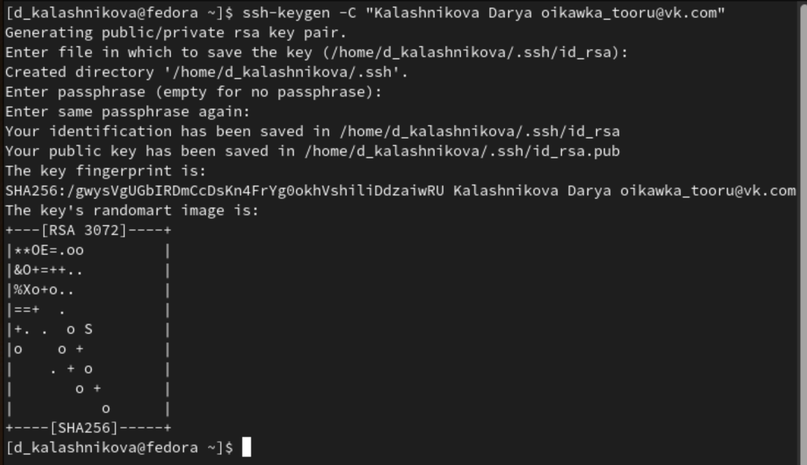{#fig:006 width=70%}

Зайдем на сайт GitHub: (рис. [-@fig:007]).

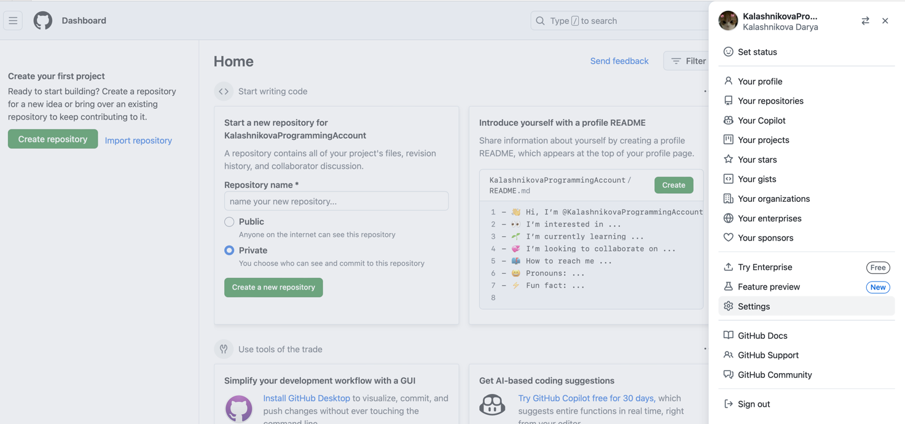{#fig:007 width=70%}

Находим раздел SSH and GPG keys и нажимаем New SSH key: (рис. [-@fig:008]).

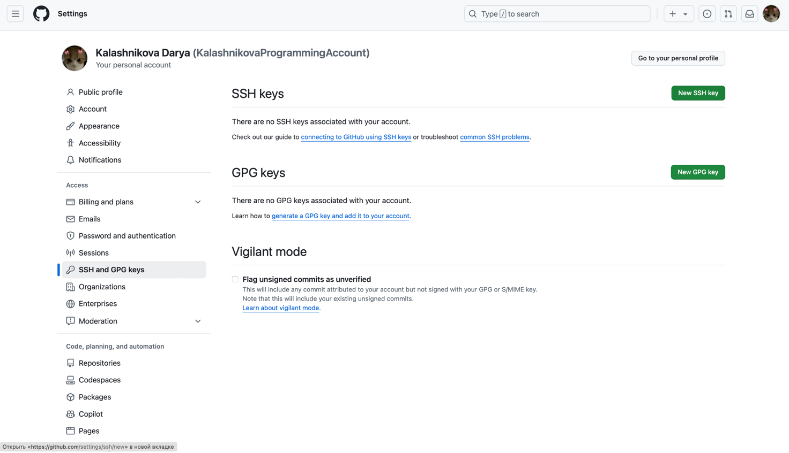{#fig:008 width=70%}

В предложенное поле "Key" нам необходимо вставить ключ, который мы только что сгенерировали: (рис. [-@fig:009]).

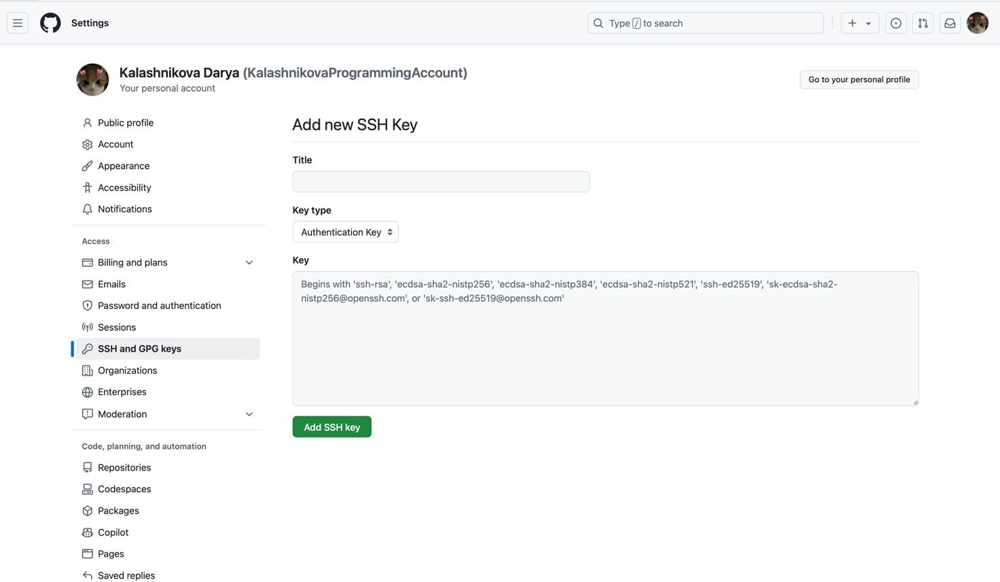{#fig:009 width=70%}

Для того, чтобы скопировать ключ для последующей вставки, нам необходимо ввести следующую команду: (рис. [-@fig:010]).(рис. [-@fig:011]).

{#fig:010 width=70%}

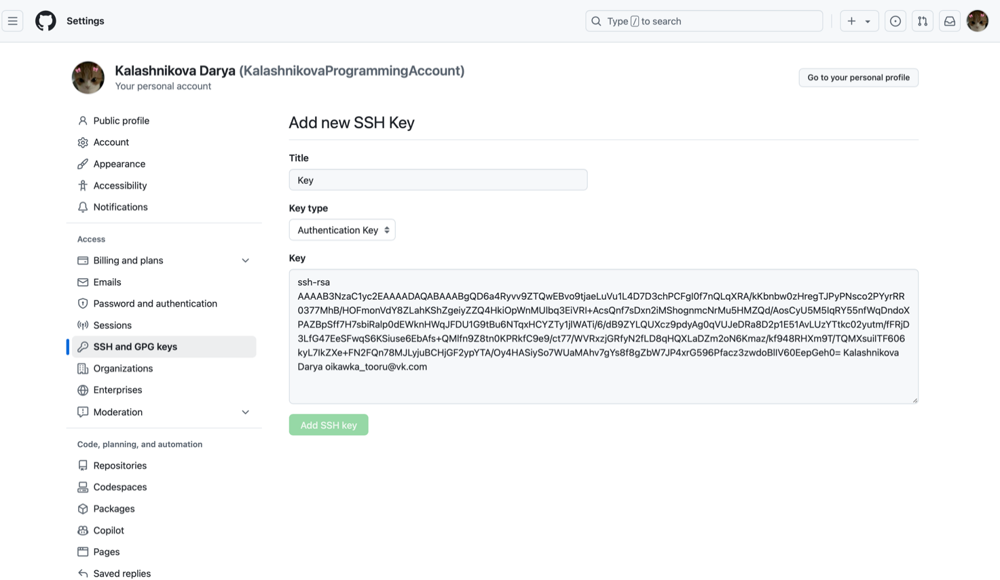{#fig:011 width=70%}

Теперь нам необходимо организовать наше рабочее пространство. Для этого
создадим каталог "Архитектура компьютера" по следующему адресу: (рис. [-@fig:012]).

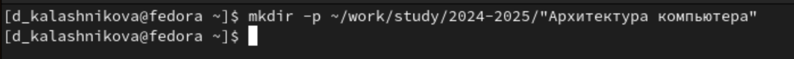{#fig:012 width=70%}

После этого нам нужно будет создать репозиторий. Мы будем его создавать на основе шаблона, который находится по следующему адресу: https://github.com/yamadharma/cour se-directory-student-template. (рис. [-@fig:013]).

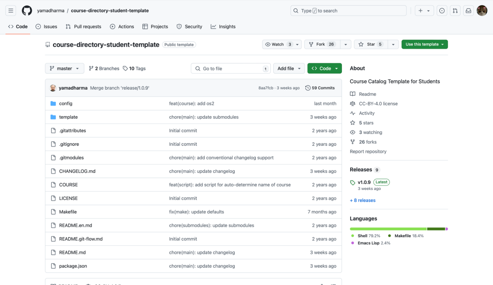{#fig:013 width=70%}

Нажимаем на кнопку "Use this template", и в предложенных опциях выбираем "Create new repository". Далее нас переносит на следующую страницу (рис. 15). Здесь задаём имя нашего репозитория. Он будет называться так: study_2024-2025_arh-pc: (рис. [-@fig:014]).

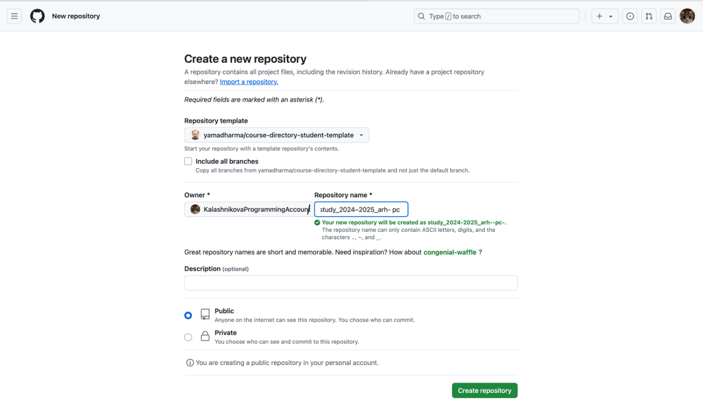{#fig:014 width=70%}

Теперь нам нужно клонировать репозиторий на наш компьютер. Для этого перейдем в папку, в которую мы хотим скопировать репозиторий. В нашем случае это заранее созданная папка:(рис. [-@fig:015]).

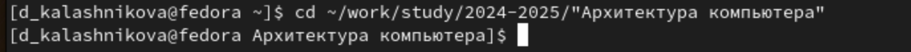{#fig:015 width=70%}

Теперь перейдем непосредственно к клонированию. Для этого воспользуемся командой git clone, в аргументе указав ссылку на репозиторий. Ссылку можно найти при нажатии на кнопку код на странице нашего репозитория. (рис. [-@fig:016]).(рис. [-@fig:017]).

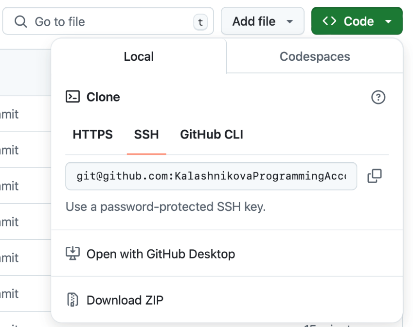{#fig:016 width=70%}

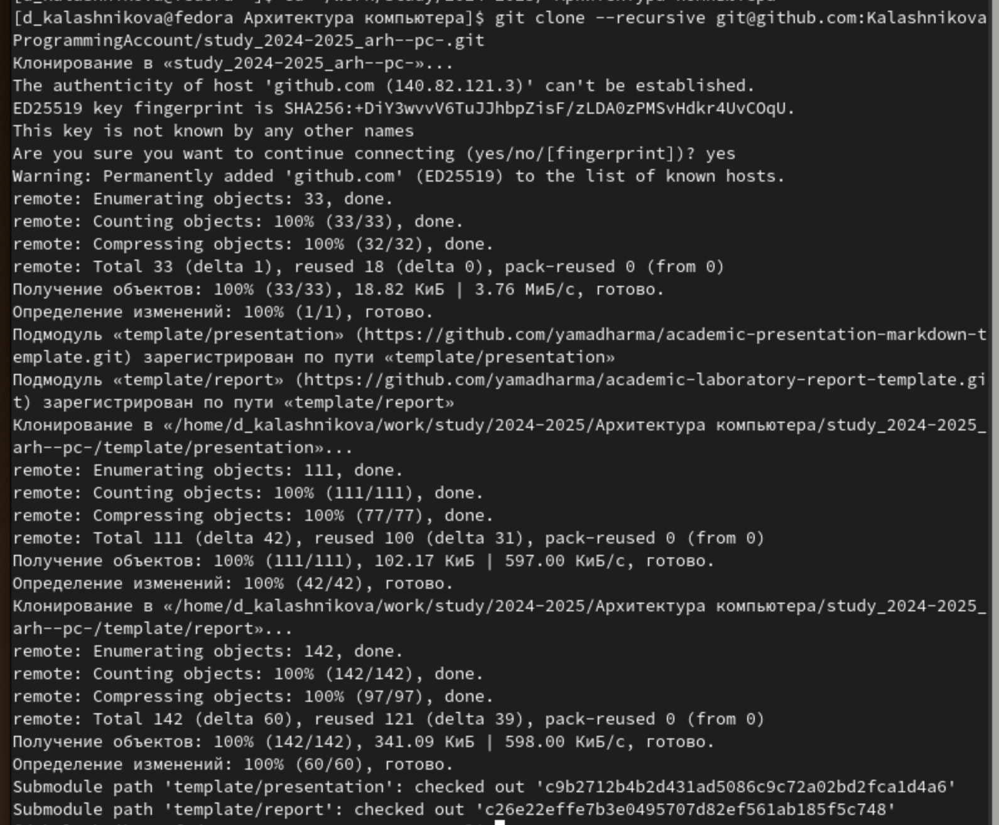{#fig:017 width=70%}

Теперь перейдем к настройке клонированного каталога. Для начала перейдем в него с помощью команды "cd": (рис. [-@fig:018]).

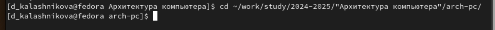{#fig:018 width=70%}

Удалим с помощью команды "rm" лишний файл: (рис. [-@fig:019]).

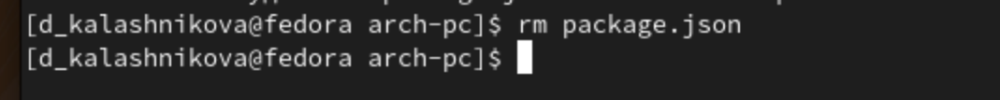{#fig:019 width=70%}

Теперь создадим необходимые файлы. В нашем случае, это будет файл COURSE. Чтобы его создать, мы воспользуемся командой echo, которая запишет в файл строку "acrh-pc" и автоматически создаст его, т.к. этого файла раньше не существовало: (рис. [-@fig:020]).

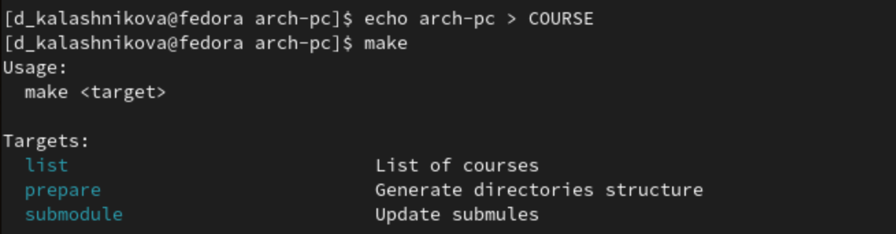{#fig:020 width=70%}

Теперь нам остается лишь отправить файлы на сервер. Для этого с помощью команды git add мы добавим каталоги, которые должны отправляться на сервер. В качестве аргумента мы возьмем точку, которая укажет на то, что мы должны отправить на сервер все файлы и каталоги, которые по иерархии находятся ниже нашего текущего расположения: (рис. [-@fig:021]).

{#fig:021 width=70%}

Теперь с помощью команды git commit мы сохраним изменения и укажем комментарий, в котором будет поясняться, какие изменения мы сделали. В данном случае в комментарии мы напишем, что создали структуру курса: (рис. [-@fig:022]).

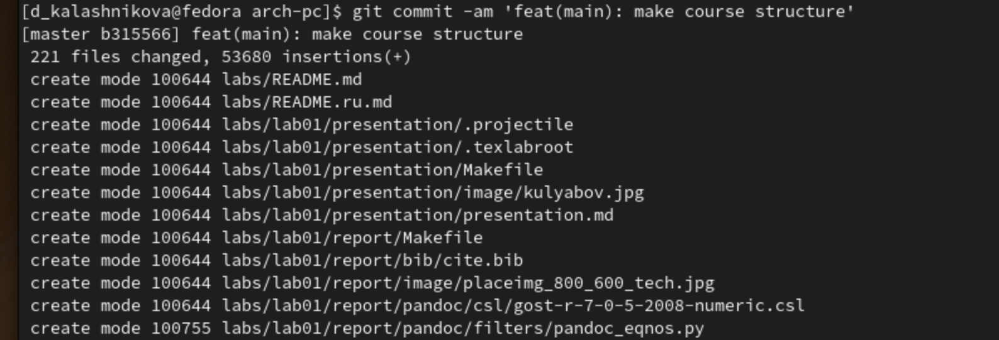{#fig:022 width=70%}

Теперь нам осталось окончательно загрузить изменения на сервер. Для этого
мы воспользуемся командой git push: (рис. [-@fig:023]).

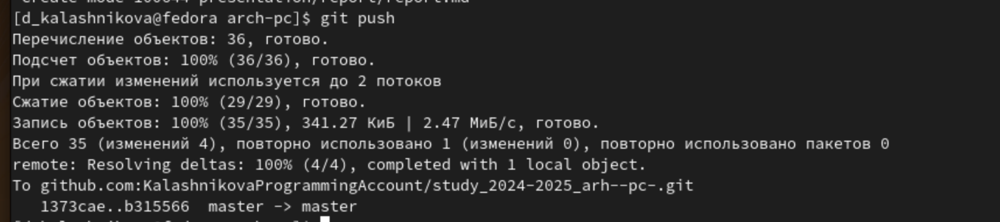{#fig:023 width=70%}

Остается лишь проверить, сохранились ли файлы на сервере. Сравним файлы, которые находятся на GitHub с теми файлами, что находятся на нашем компьютере: (рис. [-@fig:024]).(рис. [-@fig:025]).

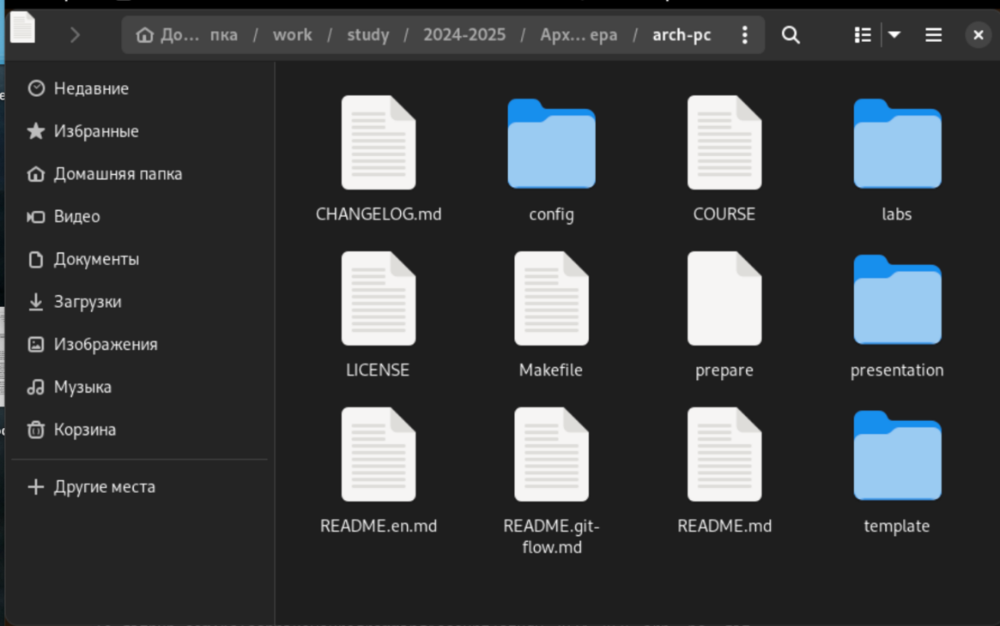{#fig:024 width=70%}

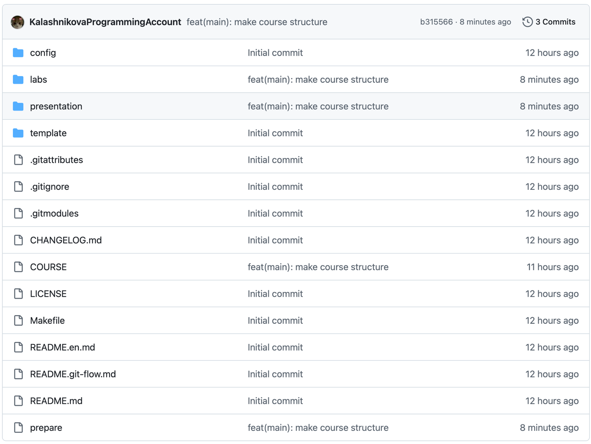{#fig:025 width=70%}

Всё совпало.

# Задание для самостоятельной работы
Задание №1. Теперь приступим к выполнению самостоятельной работы.
Для начала мы создадим файл отчета для нашей лабораторной работы в папке labs/lab02/report с помощью LibreOffice. (рис. [-@fig:026]).

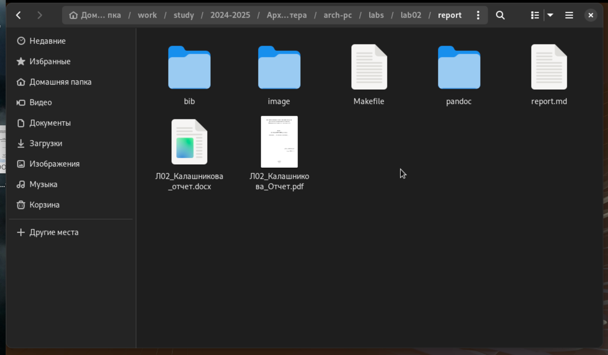{#fig:026 width=70%}

Задание №2. Копируем отчет по нашей предыдущей лабораторной работе в соответствующую папку созданного нами рабочего пространства, то есть в папку labs/lab01/report. Для копирования воспользуемся командой "cp": (рис. [-@fig:027]).

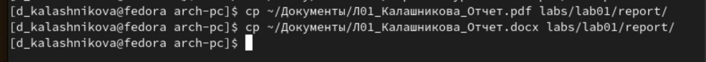{#fig:027 width=70%}

Задание №3. Теперь нам осталось лишь загрузить изменения на GitHub. Для этого нам нужно повторить те шаги, которые мы выполнили в предыдущих пунктах лабораторной работы, а именно, воспользоваться командой "git add ." для того, чтобы указать, что мы хотим сохранить изменения во всех файлах, находящихся в нашем каталоге. (рис. [-@fig:028]).

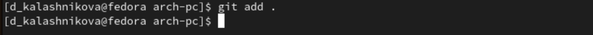{#fig:028 width=70%}

После этого с помощью команды "git commit" мы укажем комментарий и сохраним изменения. В комментарии мы укажем, что мы загрузили первую и вторую лабораторные работы. (рис. [-@fig:029]).

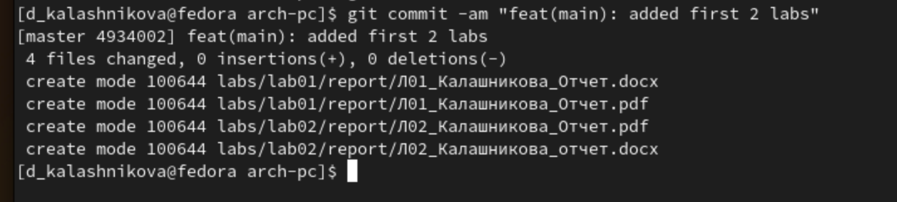{#fig:029 width=70%}

После этого вводим команду "git push" для того, чтобы загрузить наши файлы на GitHub. (рис. [-@fig:030]).

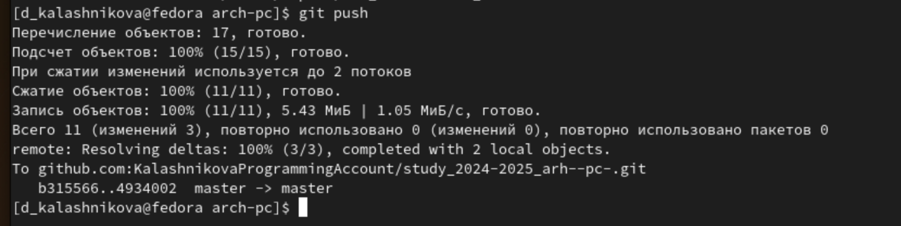{#fig:030 width=70%}

Остается лишь проверить, правильно ли мы все загрузили. Для этого посмотрим время обновления файлов в папке labs в GitHub: (рис. [-@fig:031]).(рис. [-@fig:032]).(рис. [-@fig:033]).

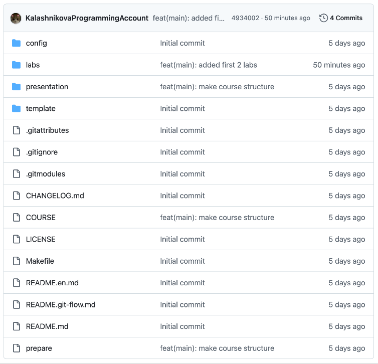{#fig:031 width=70%}

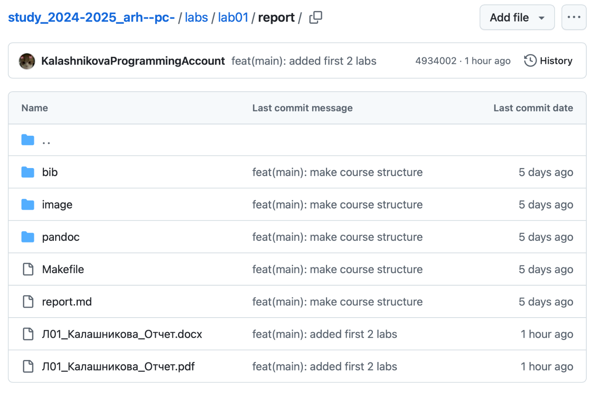{#fig:032 width=70%}

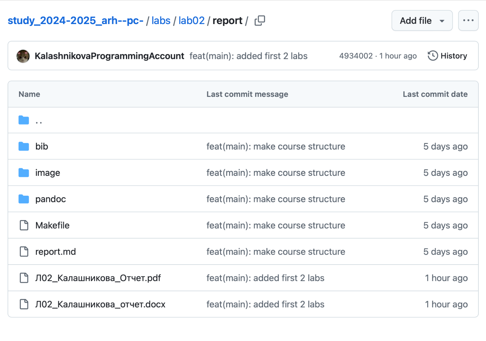{#fig:033 width=70%}

# Выводы

В результате выполнения лабораторной работы появились практические
навыки работы с системой контроля версий Git, была произведена её первоначальная настройка в linux. Было изучено, как создавать репозитории, сохранять изменения и добавлять к ним комментарии, а также как выгружать файлы на сервер. Были приобретены навыки работы с платформой GitHub.

