---
## Front matter
title: "Лабораторная работа №3"
subtitle: "Язык разметки Markdown"
author: "Калашникова Дарья Викторовна"

## Generic otions
lang: ru-RU
toc-title: "Содержание"

## Bibliography
bibliography: bib/cite.bib
csl: pandoc/csl/gost-r-7-0-5-2008-numeric.csl

## Pdf output format
toc: true # Table of contents
toc-depth: 2
lof: true # List of figures
lot: true # List of tables
fontsize: 12pt
linestretch: 1.5
papersize: a4
documentclass: scrreprt
## I18n polyglossia
polyglossia-lang:
  name: russian
  options:
	- spelling=modern
	- babelshorthands=true
polyglossia-otherlangs:
  name: english
## I18n babel
babel-lang: russian
babel-otherlangs: english
## Fonts
mainfont: IBM Plex Serif
romanfont: IBM Plex Serif
sansfont: IBM Plex Sans
monofont: IBM Plex Mono
mathfont: STIX Two Math
mainfontoptions: Ligatures=Common,Ligatures=TeX,Scale=0.94
romanfontoptions: Ligatures=Common,Ligatures=TeX,Scale=0.94
sansfontoptions: Ligatures=Common,Ligatures=TeX,Scale=MatchLowercase,Scale=0.94
monofontoptions: Scale=MatchLowercase,Scale=0.94,FakeStretch=0.9
mathfontoptions:
## Biblatex
biblatex: true
biblio-style: "gost-numeric"
biblatexoptions:
  - parentracker=true
  - backend=biber
  - hyperref=auto
  - language=auto
  - autolang=other*
  - citestyle=gost-numeric
## Pandoc-crossref LaTeX customization
figureTitle: "Рис."
tableTitle: "Таблица"
listingTitle: "Листинг"
lofTitle: "Список иллюстраций"
lotTitle: "Список таблиц"
lolTitle: "Листинги"
## Misc options
indent: true
header-includes:
  - \usepackage{indentfirst}
  - \usepackage{float} # keep figures where there are in the text
  - \floatplacement{figure}{H} # keep figures where there are in the text
---

# Цель работы

Целью работы является получение практических и теоретических навыков работы с языком разметки Markdown на примере оформления отчёта лабораторной работы.

# Выполнение лабораторной работы

Для начала выполнения лабораторной работы нам необходимо открыть рерминал и переместиться в рабочий каталог: (рис. [-@fig:001]).

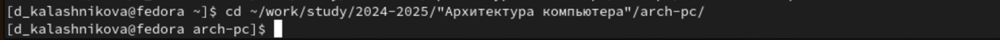{#fig:001 width=70%}

Перемещение в рабочий каталог

После этого нужно обновить локальный репозиторий с помощью команды git pull. Так мы синхронизируем файлы на компьютере с файлами на Github’е: (рис. [-@fig:002]).

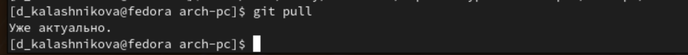{#fig:002 width=70%}

Перейдём в каталог лабораторной работы номер 3: (рис. [-@fig:003]).

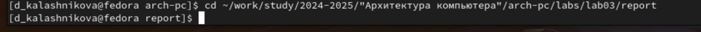{#fig:003 width=70%}

Теперь проведём компиляцию шаблона отчёта с помощью команды make: (рис. [-@fig:004]).

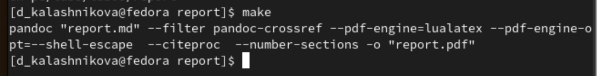{#fig:004 width=70%}

Теперь проверим, создались ли файлы .docx и .pdf: (рис. [-@fig:005]).(рис. [-@fig:006]).(рис. [-@fig:007]).

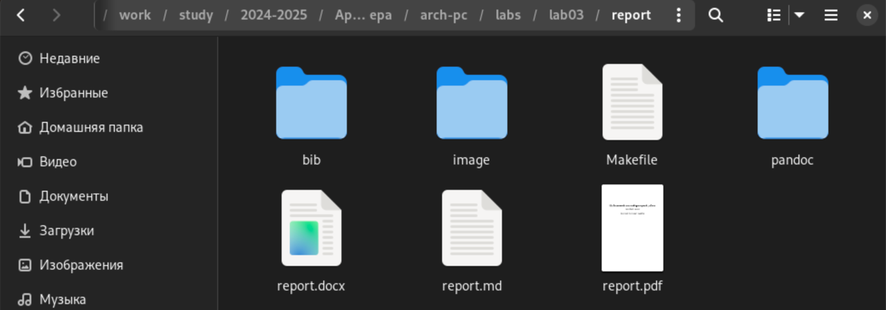{#fig:005 width=70%}

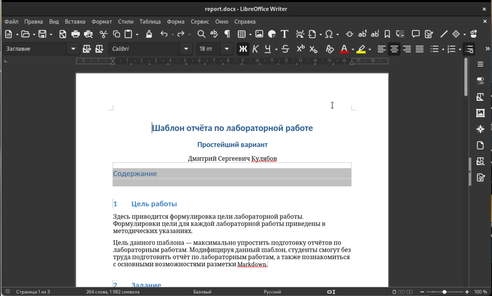{#fig:006 width=70%}

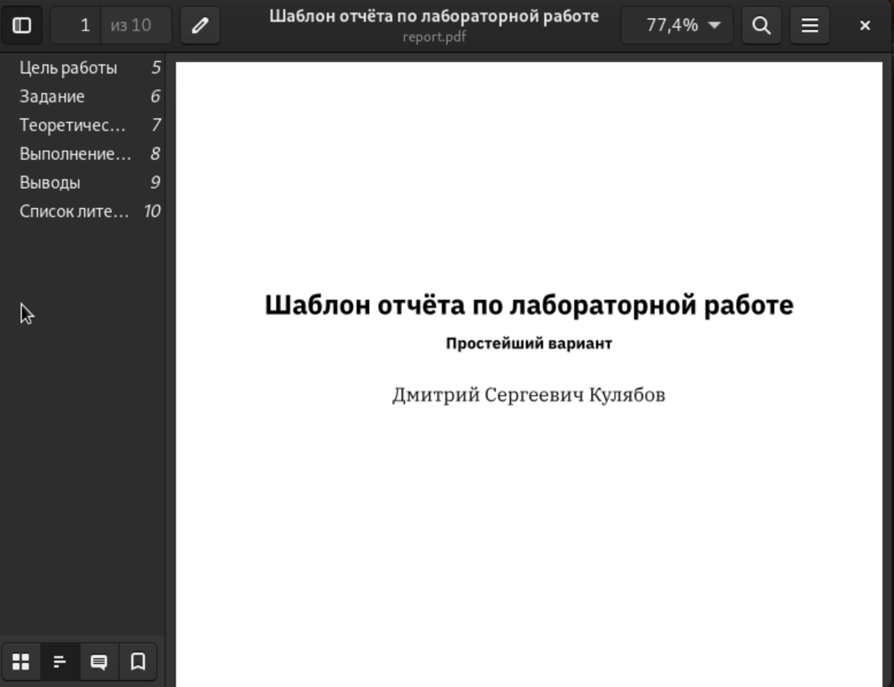{#fig:007 width=70%}

Теперь попробуем удалить эти файлы. Для этого воспользуемся командой make clean: (рис. [-@fig:008]).

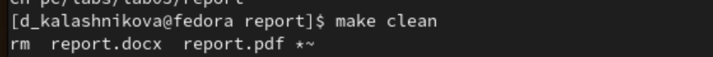{#fig:008 width=70%}

А теперь проверим, удалились ли файлы отчёта: (рис. [-@fig:009]).

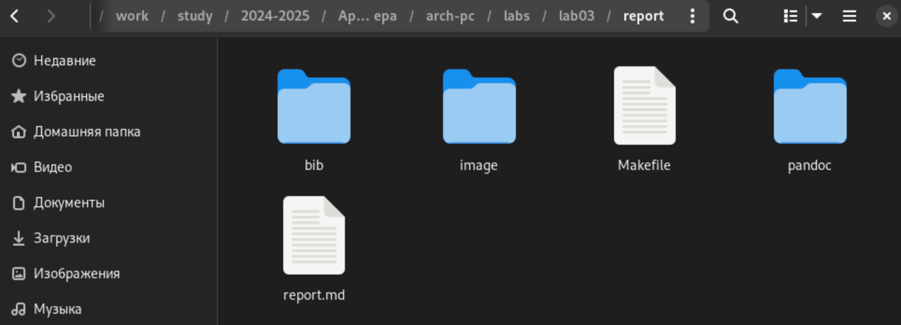{#fig:009 width=70%}

Теперь откроем файл отчёта report.md с помощью редактора gedit: (рис. [-@fig:010]).

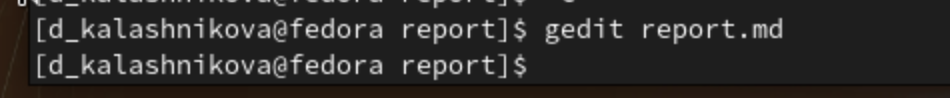{#fig:010 width=70%}

Теперь посмотрим, что из себя представляет файл report.md: (рис. [-@fig:011]).

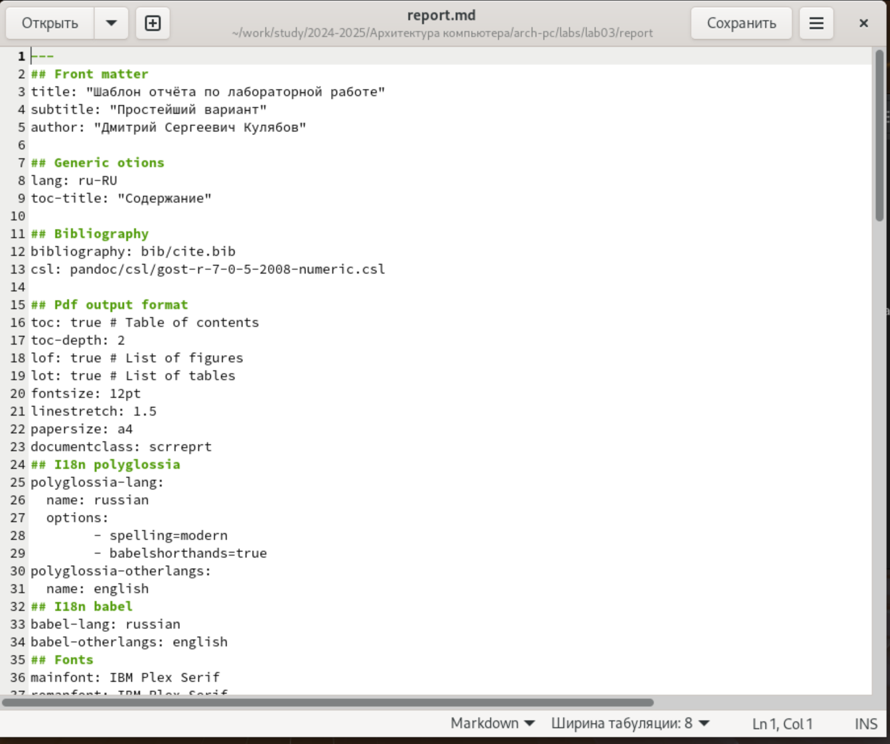{#fig:011 width=70%}

После заполнения отчёта прописываем команду make, чтобы скомпилировать готовый отчёт: (рис. [-@fig:012]).

{#fig:012 width=70%}

Теперь перейдём в рабочий каталог: (рис. [-@fig:013]).

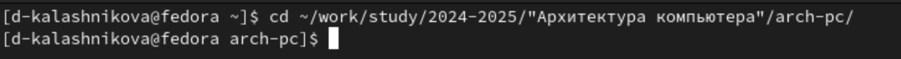{#fig:013 width=70%}

Теперь с помощью git отправим файлы лабораторной работы на Github. В качестве комментария укажем, что мы добавляем файлы для третьей лабораторной работы: (рис. [-@fig:014]).

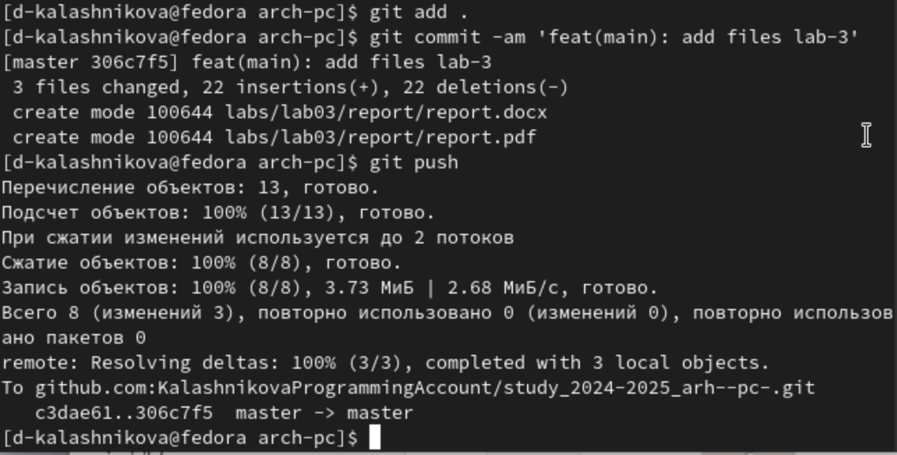{#fig:014 width=70%}

# Выполнение задания для самостоятельной работы

Теперь нам нужно переделать вторую лабораторную работу в формат Markdown. Для этого необходимо для начала перейти в каталог второй лабораторной работы: (рис. [-@fig:015]).

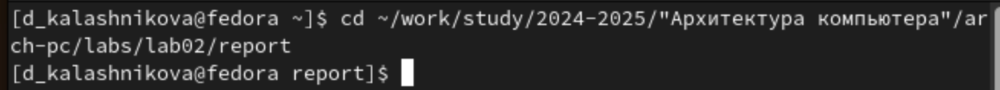{#fig:015 width=70%}

Откроем файл лабораторной работы с помощью gedit: (рис. [-@fig:016]).

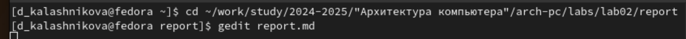{#fig:016 width=70%}

Заполним титульную страницу: (рис. [-@fig:017]).

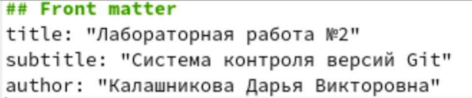{#fig:017 width=70%}

Заполним цель работы и пункт выполнения лабораторной работы: (рис. [-@fig:018]).

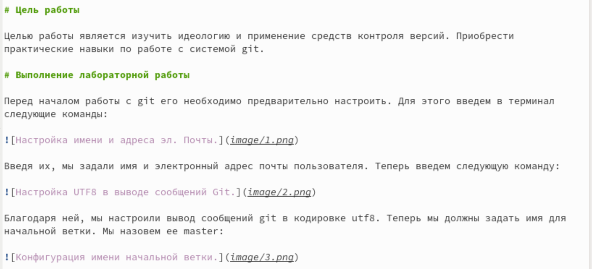{#fig:018 width=70%}

Напишем в отчёте задание для самостоятельной работы: (рис. [-@fig:019]).

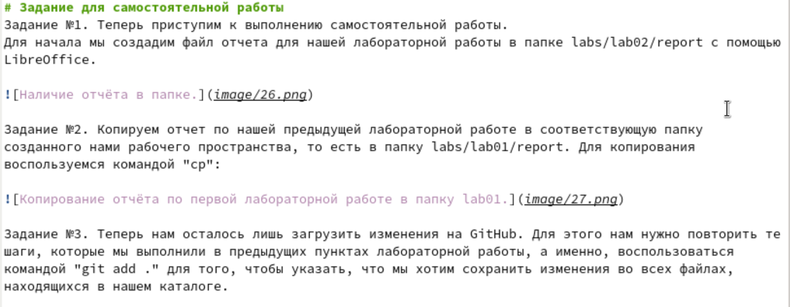{#fig:019 width=70%}

И заполним выводы: (рис. [-@fig:020]).

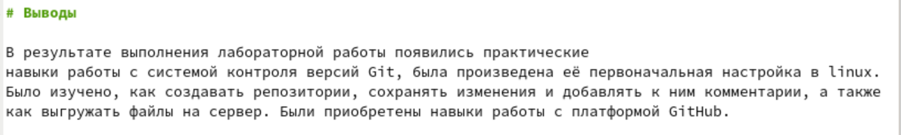{#fig:020 width=70%}

Также, поместим скриншоты в отдельную папку image: (рис. [-@fig:021]).

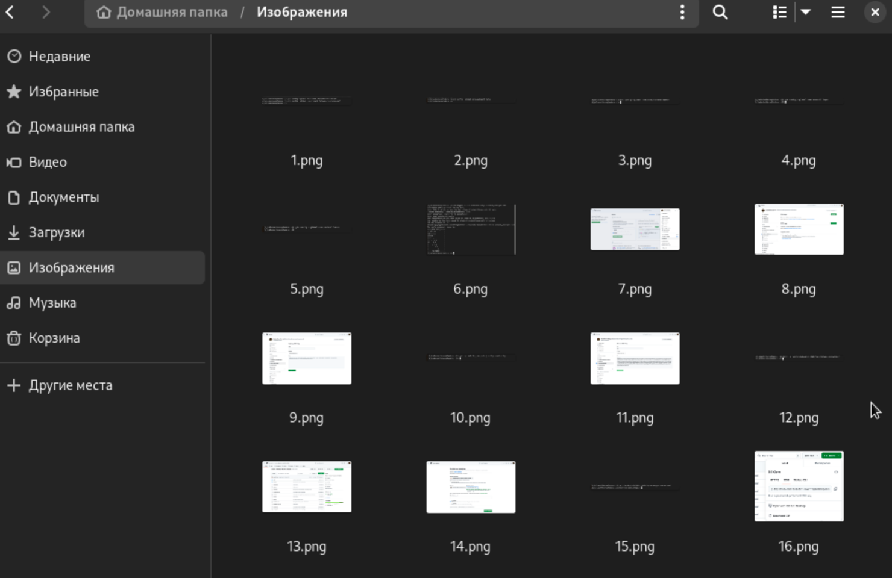{#fig:021 width=70%}

Теперь соберём отчёт с помощью команды make: (рис. [-@fig:022]).

{#fig:022 width=70%}

Теперь осталось отправить файлы на Github. Для этого сначала перейдём в рабочий каталог: (рис. [-@fig:023]).

{#fig:023 width=70%}

И после этого используем Git Для отправки. В комментарии укажем, что добавляем файлы для лабораторной работы номер 2: (рис. [-@fig:024]).(рис. [-@fig:025]).

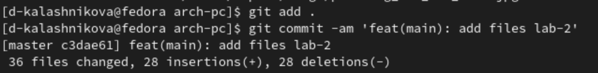{#fig:024 width=70%}

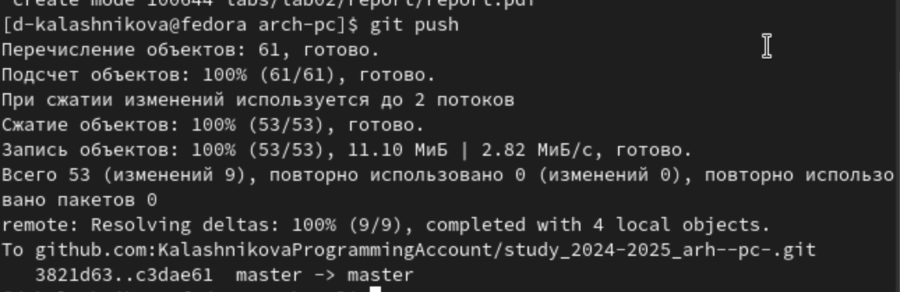{#fig:025 width=70%}

# Выводы

В результате выполнения лабораторной работы были получены навыки работы с языком разметки Markdown, а также были заполнены отчёты для двух лабораторных работ. 

