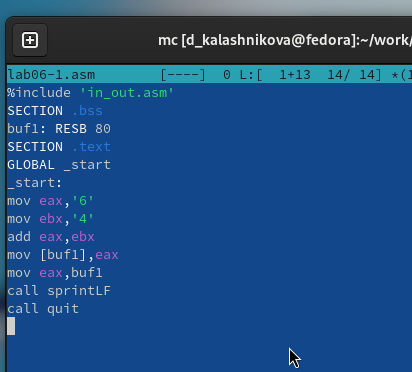
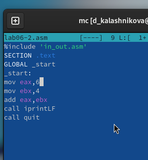
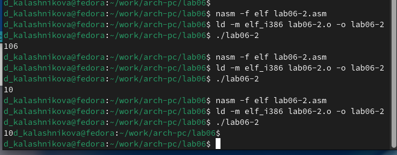
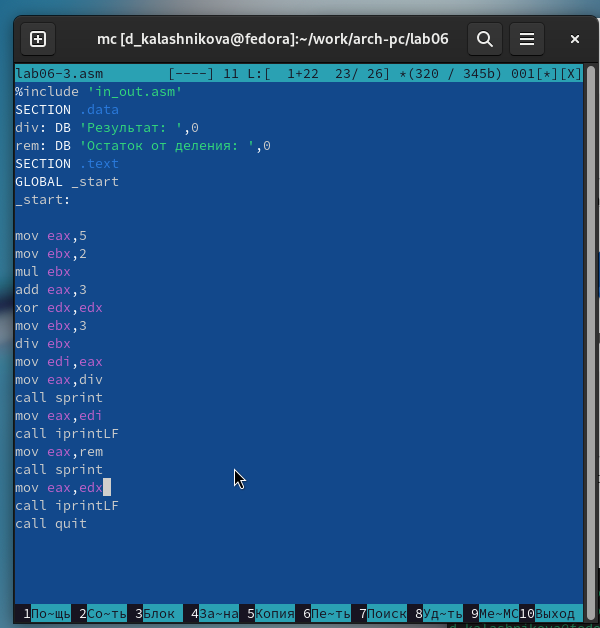
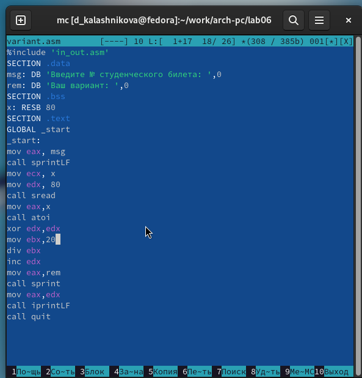
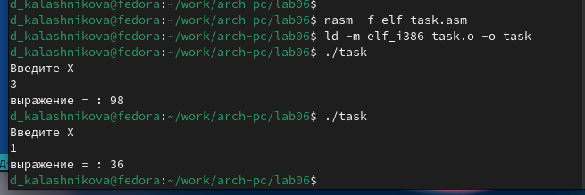

---
## Front matter
title: "Отчёт по лабораторной работе 6"
subtitle: "Арифметические операции в NASM."
author: "Калашникова Дарья Викторовна"

## Generic otions
lang: ru-RU
toc-title: "Содержание"

## Bibliography
bibliography: bib/cite.bib
csl: pandoc/csl/gost-r-7-0-5-2008-numeric.csl

## Pdf output format
toc: true # Table of contents
toc-depth: 2
lof: true # List of figures
lot: true # List of tables
fontsize: 12pt
linestretch: 1.5
papersize: a4
documentclass: scrreprt
## I18n polyglossia
polyglossia-lang:
  name: russian
  options:
	- spelling=modern
	- babelshorthands=true
polyglossia-otherlangs:
  name: english
## I18n babel
babel-lang: russian
babel-otherlangs: english
## Fonts
mainfont: PT Serif
romanfont: PT Serif
sansfont: PT Sans
monofont: PT Mono
mainfontoptions: Ligatures=TeX
romanfontoptions: Ligatures=TeX
sansfontoptions: Ligatures=TeX,Scale=MatchLowercase
monofontoptions: Scale=MatchLowercase,Scale=0.9
## Biblatex
biblatex: true
biblio-style: "gost-numeric"
biblatexoptions:
  - parentracker=true
  - backend=biber
  - hyperref=auto
  - language=auto
  - autolang=other*
  - citestyle=gost-numeric
## Pandoc-crossref LaTeX customization
figureTitle: "Рис."
tableTitle: "Таблица"
listingTitle: "Листинг"
lofTitle: "Список иллюстраций"
lotTitle: "Список таблиц"
lolTitle: "Листинги"
## Misc options
indent: true
header-includes:
  - \usepackage{indentfirst}
  - \usepackage{float} # keep figures where there are in the text
  - \floatplacement{figure}{H} # keep figures where there are in the text
---

# Цель работы

Целью работы является освоение арифметических инструкций языка ассемблера NASM.

# Выполнение лабораторной работы

## Символьные и численные данные в NASM

Я создаю каталог для программ лабораторной работы № 6, перехожу в него и создаю файл `lab6-1.asm`.

Программы, которые будут приведены далее, демонстрируют вывод символьных и численных значений, записанных в регистр `eax`.

В первой программе в регистр `eax` записывается символ `6` с помощью команды `mov eax, '6'`, а в регистр `ebx` – символ `4` с помощью команды `mov ebx, '4'`. Далее, к значению в регистре `eax` прибавляется значение регистра `ebx` командой `add eax, ebx`. Результат сложения записывается в регистр `eax`. После этого выводится результат. 

Так как функция `sprintLF` требует, чтобы в регистр `eax` был записан адрес, используется дополнительная переменная. Для этого записываю значение из регистра `eax` в переменную `buf1` командой `mov [buf1], eax`, затем записываю адрес переменной `buf1` в регистр `eax` командой `mov eax, buf1` и вызываю функцию `sprintLF`.

{ #fig:001 width=70%, height=70% }

{ #fig:002 width=70%, height=70% }

При выводе значения из регистра `eax` мы ожидаем увидеть число `10`. Однако результатом будет символ `j`. Это происходит потому, что код символа `6` равен `54` в десятичной системе (или `00110110` в двоичной), а код символа `4` – `52` в десятичной системе (или `00110100` в двоичной). После выполнения команды `add eax, ebx`, в регистр `eax` записывается сумма кодов, равная `106`, что соответствует символу `j`.

Далее, в программе вместо символов записываю в регистры числа.

{ #fig:003 width=70%, height=70% }

{ #fig:004 width=70%, height=70% }

Как и в предыдущем примере, выводится не число `10`, а символ с кодом `10`, который представляет собой символ конца строки. Этот символ не отображается в консоли, но добавляет пустую строку.

Для работы с числами в файле `in_out.asm` реализованы функции для преобразования символов ASCII в числа и наоборот. Преобразую программу с использованием этих функций.

{ #fig:005 width=70%, height=70% }

{ #fig:006 width=70%, height=70% }

Результатом работы программы будет число `106`. Здесь, как и в первом примере, команда `add` складывает коды символов `6` и `4` (54 + 52 = 106). Однако, в отличие от предыдущей программы, функция `iprintLF` позволяет вывести именно число, а не символ, соответствующий данному коду.

Заменяю символы на числа.

{ #fig:007 width=70%, height=70% }

В данном случае, благодаря функции `iprintLF`, выводится число `10`, так как операндами являются числа.

{ #fig:008 width=70%, height=70% }

Заменяю функцию `iprintLF` на `iprint` и создаю исполняемый файл, затем запускаю программу. Вывод отличается тем, что теперь нет переноса строки.

{ #fig:009 width=70%, height=70% }

## Выполнение арифметических операций в NASM

Примером арифметических операций в NASM будет программа для вычисления выражения $ f(x) = (5 * 2 + 3)/3 $.

{ #fig:010 width=70%, height=70% }

{ #fig:011 width=70%, height=70% }

Изменяю программу для вычисления выражения $ f(x) = (4 * 6 + 2)/5 $. Создаю исполняемый файл и проверяю его работу.

{ #fig:012 width=70%, height=70% }

{ #fig:013 width=70%, height=70% }

Другим примером будет программа для вычисления варианта задания по номеру студенческого билета. В этом случае число, с которым производятся арифметические операции, вводится с клавиатуры. Для корректной работы с числами, введенные символы необходимо преобразовать в числовой формат, для чего используется функция `atoi` из файла `in_out.asm`.

{ #fig:014 width=70%, height=70% }

{ #fig:015 width=70%, height=70% }

## Ответы на вопросы

1. **Какие строки листинга отвечают за вывод на экран сообщения ‘Ваш вариант:’?**
   - Инструкция `mov eax, rem` записывает значение переменной с фразой ‘Ваш вариант:’ в регистр `eax`.
   - Инструкция `call sprint` вызывает подпрограмму для вывода строки.

2. **Для чего используются следующие инструкции?**
   - `mov ecx, x` — записывает значение переменной `x` в регистр `ecx`.
   - `mov edx, 80` — записывает значение `80` в регистр `edx`.
   - `call sread` — вызывает подпрограмму для считывания значения студенческого билета.

3. **Для чего используется инструкция “call atoi”?**
   - Инструкция “call atoi” используется для преобразования введенных символов в числовой формат.

4. **Какие строки листинга отвечают за вычисления варианта?**
   - `xor edx, edx` — обнуляет регистр `edx`.
   - `mov ebx, 20` — записывает значение `20` в регистр `ebx`.
   - `div ebx` — выполняет деление номера студенческого билета на `20`.
   - `inc edx` — увеличивает значение в регистре `edx` на `1`.

   Здесь происходит деление номера студенческого билета на `20`. Остаток записывается в регистр `edx`, к которому добавляется `1`.

5. **В какой регистр записывается остаток от деления при выполнении инструкции “div ebx”?**
   - Остаток от деления записывается в регистр `edx`.

6. **Для чего используется инструкция “inc edx”?**
   - Инструкция “inc edx” увеличивает значение в регистре `edx` на `1`, согласно формуле вычисления варианта.

7. **Какие строки листинга отвечают за вывод на экран результата вычислений?**
   - Инструкция `mov eax, edx` записывает результат в регистр `eax`.
   - Инструкция `call iprintLF` вызывает подпрограмму для вывода значения на экран.

## Задание для самостоятельной работы

Необходимо написать программу для вычисления выражения $ y = f(x) $, которая должна выводить выражение для вычисления, запросить ввод значения `x`, вычислить выражение в зависимости от введенного значения и вывести результат. Вид функции $ f(x) $ должен быть выбран согласно таблице 6.3 вариантов заданий.

Мы получили вариант `9` для выражения $ 10+(31x - 5)$ с $ x=3, x=1 $.

{ #fig:016 width=70%, height=70% }

При $ x=1 $ результат равен `98`.

При $ x=3 $ результат равен `36`.

{ #fig:017 width=70%, height=70% }

Программа работает правильно.

# Выводы

Изучили работу с арифметическими операциями.