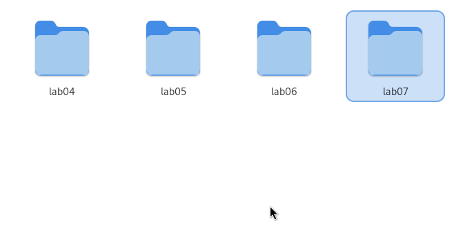
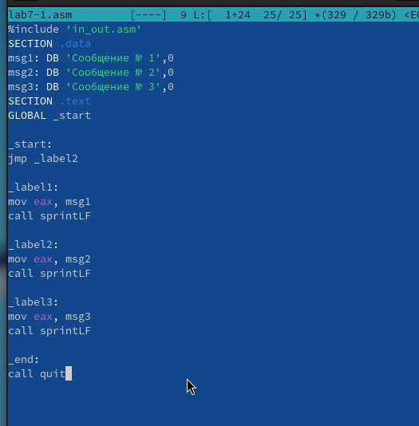
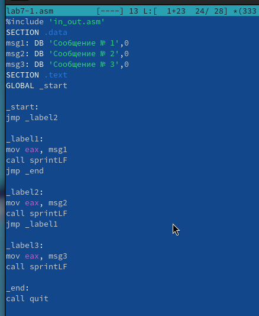
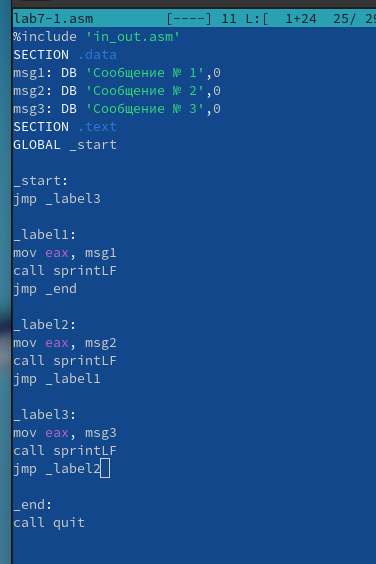
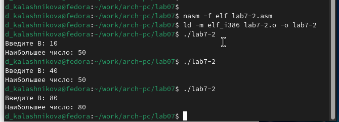
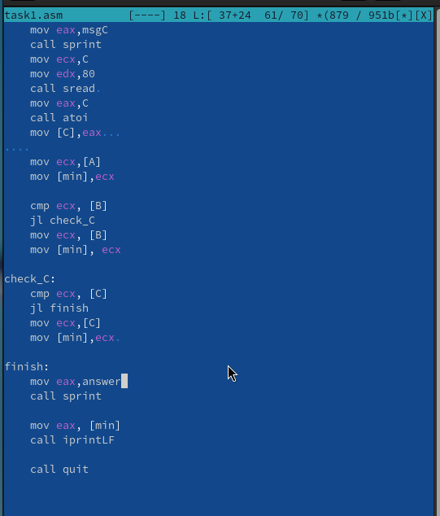
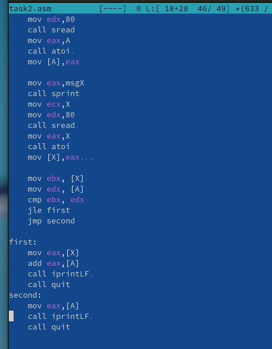
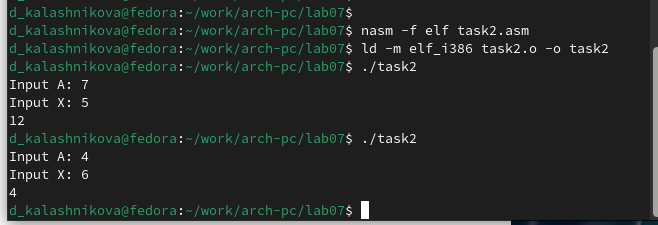

---
## Front matter
title: "Отчёт по лабораторной работе 7"
subtitle: "Команды безусловного и условного переходов в Nasm."
author: "Калашникова Дарья Викторовна"

## Generic otions
lang: ru-RU
toc-title: "Содержание"

## Bibliography
bibliography: bib/cite.bib
csl: pandoc/csl/gost-r-7-0-5-2008-numeric.csl

## Pdf output format
toc: true # Table of contents
toc-depth: 2
lof: true # List of figures
lot: true # List of tables
fontsize: 12pt
linestretch: 1.5
papersize: a4
documentclass: scrreprt
## I18n polyglossia
polyglossia-lang:
  name: russian
  options:
	- spelling=modern
	- babelshorthands=true
polyglossia-otherlangs:
  name: english
## I18n babel
babel-lang: russian
babel-otherlangs: english
## Fonts
mainfont: PT Serif
romanfont: PT Serif
sansfont: PT Sans
monofont: PT Mono
mainfontoptions: Ligatures=TeX
romanfontoptions: Ligatures=TeX
sansfontoptions: Ligatures=TeX,Scale=MatchLowercase
monofontoptions: Scale=MatchLowercase,Scale=0.9
## Biblatex
biblatex: true
biblio-style: "gost-numeric"
biblatexoptions:
  - parentracker=true
  - backend=biber
  - hyperref=auto
  - language=auto
  - autolang=other*
  - citestyle=gost-numeric
## Pandoc-crossref LaTeX customization
figureTitle: "Рис."
tableTitle: "Таблица"
listingTitle: "Листинг"
lofTitle: "Список иллюстраций"
lotTitle: "Список таблиц"
lolTitle: "Листинги"
## Misc options
indent: true
header-includes:
  - \usepackage{indentfirst}
  - \usepackage{float} # keep figures where there are in the text
  - \floatplacement{figure}{H} # keep figures where there are in the text
---

# Цель работы

Целью работы является изучение команд условного и безусловного переходов. Приобретение навыков написания программ с использованием переходов. Знакомство с назначением и структурой файла листинга.

# Выполнение лабораторной работы

## Реализация переходов в NASM

Создаю каталог для программ лабораторной работы № 7 и файл lab7-1.asm. (рис. [-@fig:001])

{ #fig:001 width=70%, height=70% }

Инструкция jmp в NASM используется для реализации безусловных переходов. Пример программы, демонстрирующей эту инструкцию, приведен в файле lab7-1.asm. (рис. [-@fig:002])

{ #fig:002 width=70%, height=70% }

Создаю исполняемый файл и запускаю его. (рис. [-@fig:003])

{ #fig:003 width=70%, height=70% }

Инструкция jmp позволяет осуществлять переходы как вперед, так и назад. Для изменения последовательности вывода программы добавляю метки _label1 и _end. Таким образом, вывод программы изменится: сначала отобразится сообщение № 2, затем сообщение № 1, и программа завершит работу.

Обновляю текст программы согласно листингу 7.2. (рис. [-@fig:004], рис. [-@fig:005])

{ #fig:004 width=70%, height=70% }

{ #fig:005 width=70%, height=70% }

Дорабатываю текст программы для вывода следующих сообщений: 

Сообщение № 3  
Сообщение № 2  
Сообщение № 1  

Результат показан на рисунках (рис. [-@fig:006], рис. [-@fig:007]).

{ #fig:006 width=70%, height=70% }

{ #fig:007 width=70%, height=70% }

Использование инструкции jmp обеспечивает переходы независимо от условий. Однако для реализации условных переходов требуется использование дополнительных инструкций.

## Условные переходы

Для демонстрации условных переходов создаю программу, определяющую максимальное значение среди трех переменных: A, B и C. Значения A и C задаются в программе, а B вводится с клавиатуры. Результаты работы программы представлены на рисунках (рис. [-@fig:008], рис. [-@fig:009]).

{ #fig:008 width=70%, height=70% }

{ #fig:009 width=70%, height=70% }

## Изучение структуры файла листинга

Для получения файла листинга указываю ключ -l при ассемблировании. Результат ассемблирования программы lab7-2.asm представлен на рисунке (рис. [-@fig:010]).

{ #fig:010 width=70%, height=70% }

Анализируя структуру листинга, можно увидеть соответствие строк кода и их машинного представления. Например:

- **Строка 203**:  
  - Номер строки: 28 
  - Адрес: 0000011C  
  - Машинный код: 3B0D[39000000]
  - Команда: cmp ecx,[C]

- **Строка 204**:  
  - Номер строки: 29  
  - Адрес: 00000122  
  - Машинный код: 7F0C  
  - Команда: jg check_B

- **Строка 205**:  
  - Номер строки: 30  
  - Адрес: 00000124  
  - Машинный код: 8B0D[39000000]
  - Команда: mov ecx,[C]
  
Далее изменяю инструкцию с двумя операндами, удаляя один, и повторяю трансляцию. Возникает ошибка, результат которой отображен на рисунках (рис. [-@fig:011], рис. [-@fig:012]).

{ #fig:011 width=70%, height=70% }

{ #fig:012 width=70%, height=70% }

## Самостоятельное задание

1. Напишите программу, которая находит наименьшее значение из трех переменных a, b и c для следующих значений:  
   **Вариант 9**: 24,98,15.  
   Результат работы программы показан на рисунках (рис. [-@fig:013], рис. [-@fig:014]).

{ #fig:013 width=70%, height=70% }

{ #fig:014 width=70%, height=70% }

2. Напишите программу для вычисления функции f(x) для введенных значений x и a:

**Вариант 9**:  

   $$ 
   f(x) =
   \begin{cases} 
   x+a, & \text{если } x \le a \\
   a, & \text{если } x > a
   \end{cases} 
   $$  
   
   
   При $x=5, a=7$ результат: $12$.  
   При $x=6, a=4$ результат: $4$.  
   Результаты программы представлены на рисунках (рис. [-@fig:015], рис. [-@fig:016]).

{ #fig:015 width=70%, height=70% }

{ #fig:016 width=70%, height=70% }

# Выводы

Изучили команды условного и безусловного переходов, познакомились с фалом листинга.